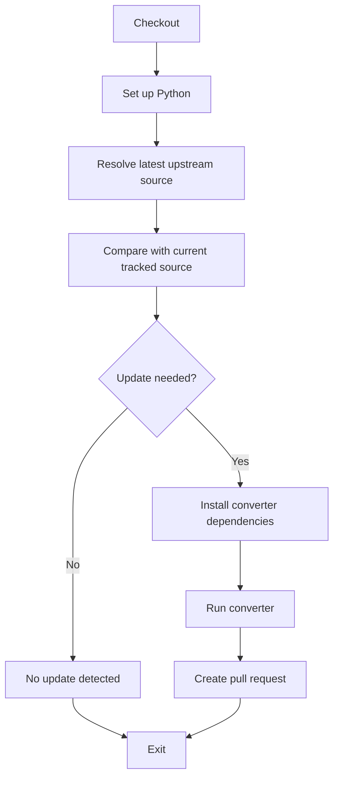

# ResistanceProfiler supported databases

This repository curates and auto-updates antiviral resistance databases in the format expected by
[ResistanceProfiler](https://github.com/the-foxlab/ResistanceProfiler) (ResPro).

Each upstream source (e.g. HIVdb, HerpesDRG) gets its own folder with a converter script that
fetches the upstream data and transforms it into ResPro's TSV schema, plus a GitHub Actions
workflow that keeps the output in sync whenever the upstream source changes.

## What this repo does

- Fetches curated upstream source data (Zenodo, GitHub, release assets, or similar).
- Converts source data into ResPro-compatible TSV artifacts.
- Tracks source rows that couldn't be migrated, with explicit reasons.
- Auto-updates outputs via GitHub Actions, opening a PR only when a new upstream version is
  detected.

## Repository layout

```text
databases/
  manifest.json                 # generated discovery file, see below

  <source_name>/
    scripts/
      convert.py
      requirements.txt
    output/
      rules.tsv
      formula-rules.tsv         # only when combination rules apply
      metadata.json
      non-migrated-rules.txt

.github/workflows/
  <source_name>-autobump.yml    # one workflow per source
```

## Discovery manifest

Unauthenticated clients can discover every available database from a single generated file:

`databases/manifest.json`

It's built from all `databases/*/output/metadata.json` files, and each entry contains the source
name, relative paths to `metadata.json`, `rules.tsv`, and `formula-rules.tsv` (empty when absent),
and the embedded metadata content.

This is the primariy file that is used to display supported databases via the ResPro command:

```bash
respro databases --list
```

## Autobump workflow pattern

Every source has its own workflow, but all follow the same steps. Implementation details vary by
source type (Zenodo API, GitHub API, release assets, etc.); the step names and flow stay the same:



| Step | Responsibility |
| --- | --- |
| **Checkout** | Clone repository code. |
| **Set up Python** | Install Python 3.12. |
| **Resolve latest upstream source** | Fetch upstream metadata: for Zenodo, the latest record ID and updated timestamp; for GitHub, the latest commit date of the source file. Produces `source_url`, a timestamp, and a version identifier (record ID or commit SHA). |
| **Compare with current tracked source** | Compare the upstream timestamp/ID against `maintainer_update` in the current `metadata.json`. Produces a `should_update` flag and `current_source_date`. |
| **Install converter dependencies** | `pip install -r databases/<source>/scripts/requirements.txt`. |
| **Run converter** | Run `convert.py` with `--source-url` and `--output-dir`. The converter fetches the upstream timestamp itself (from the API or response headers), validates the data, produces the TSV outputs, and sets `maintainer_update` in `metadata.json`. |
| **No update detected** | Informational step, shown only when no update is needed. |
| **Create pull request** | Open a PR with source metadata in the body and the regenerated output files in `add-paths`. |

All autobump PRs follow this format:

```yaml
title: "chore: autobump <source_name> outputs"
body: |
  Automated monthly/weekly update for <SOURCE> source data.
  
  - Previous source date: <previous_timestamp>
  - Source timestamp: <latest_timestamp>
  - Source version: <record_id|commit_sha>
  - Source URL: <upstream_url>
  
  This PR was generated by the autobump workflow.
labels:
  - autobump
add-paths:
  - databases/<source>/output/rules.tsv
  - databases/<source>/output/formula-rules.tsv
  - databases/<source>/output/metadata.json
  - databases/<source>/output/non-migrated-rules.txt
```

## Converter script pattern

Every `convert.py` accepts two arguments and produces consistent console output:

- `--source-url` — the upstream data source URL (hardcoded or passed from the workflow)
- `--output-dir` — the directory where TSV artifacts and `metadata.json` are written

**Console output** must go entirely to `stderr` (never `stdout`). Use an `eprint()` helper:

```python
def eprint(msg: str) -> None:
    print(msg, file=sys.stderr)
```

Converters must follow this standardized output sequence:

```text
Source date: <YYYY-MM-DD>                     # as early as possible (before or after Downloading, depending on source)
Downloading <url> …
Parsed <N> source rows                          # optional – omit for non-tabular sources
Written <rules_path> (<N> rows).
Written <formula_path> (<N> rows).              # only when formula rows exist; delete file if empty
Written <metadata_path>.
Written <non_migrated_path> (<N> aggregated entries).
Done.
```

- **All output to `stderr`** — never write progress messages to `stdout`.
- **`Source date:`** — the date used for `maintainer_update` in `metadata.json` (fetched from the upstream API, a `--source-date` argument, or a fallback). Print it as early as it's known — ideally before `Downloading`, but after is acceptable when derived from downloaded content.
- **`Downloading <url> …`** — emitted when the upstream fetch begins (use the `…` ellipsis character, not `...`).
- **`Written` lines** — one line per output file, in the order shown. The row/entry count excludes the header row. Omit the formula-rules line entirely when there are no formula rows (and delete the file if it exists).
- **`Done.`** — final line confirming successful completion.
- **Diagnostics** — `WARNING:` and `SKIPPED:` / `DROPPED:` lines may appear anywhere before `Done.`, always on `stderr`.
- **Auxiliary fetches** — converters that download extra resources (drug maps, gene data, …) may emit extra `Fetching <url> …` lines between `Downloading` and `Written`.

### Converter responsibilities

1. Download/fetch source data from `--source-url`.
2. Parse and validate the input schema.
3. Transform rows into atomic rules (one mutation per row) and, when applicable, formula rules (grouped combinations).
4. Deduplicate by `(feature, reference_id, position, mutation, antiviral, publication)`.
5. Sort deterministically for reproducible output.
6. Write `rules.tsv` with the required columns: `feature`, `reference_identifier`, `position`, `reference`, `mutation`, `antiviral`.
7. Write `formula-rules.tsv` only if `group_id` + formula cases exist.
8. Write `metadata.json` following the schema documented in the [ResistanceProfiler](https://github.com/the-foxlab/ResistanceProfiler) `docs/` folder. Fetch the source timestamp from the upstream API (fall back to today's date only if unavailable), and compute `tsv_checksum` as `sha256:<hex>` of the `rules.tsv` content.
9. Write `non-migrated-rules.txt` as an audit trail of rows that couldn't be converted.
10. Validate all required columns and fail fast on schema mismatches.
11. Print the standardized progress messages to `stderr`.

## Adding a new database

1. Create `databases/<source_name>/scripts/convert.py`, following the converter pattern above (accepting `--source-url` / `--output-dir`, fetching the upstream timestamp for `maintainer_update`).
2. Create `databases/<source_name>/scripts/requirements.txt` with its dependencies.
3. Create `.github/workflows/<source_name>-autobump.yml`, reusing the workflow steps above and adapting only "Resolve latest upstream source" for the source type.
4. Add the source's metadata to the converter's config (maintainers, publication PMID, license, etc.).

## Requesting a new database

Open a PR here with the required files, or open an issue naming the database you'd like supported. We need some kind of API for that database so we can check for updates at regular intervals and auto-update the corresponding files in this repo — please mention what's available upstream.
